# Analýza ... medzi členmi kongresu Spojených štátov Amerických
```
Veda o sieťach, 2024
Roderik Antol, Tomáš Belák, Adam Lopaška, František Václav Man
```

## Popis siete
Naša sieť popisuje rečnícke prejavy politikov Kongresu Spojených štátov. V sieti máme 219 kongresmanov (vrcholov) a 764 hrán - spomenutí kongresmana vo svojom prejave. Hrany sú orientované, váhované a graf obsahuje násobné hrany a slučky. Váha hrany závisí od charakteru spomenutia - kladné spomenutie/súhlas má váhu `1` a negatívne spomenutie/nesúhlas má váhu `-1`. 

Priemerný stupeň vrcholov siete je `6.98`. Teda za sledované obdobie bol priemerný kongresman spomenutý v niekoho reči (aj svojej), alebo spomínal niekoho vo svojej skoro 7-krát.

<!Naša sieť obsahuje 219 vrcholov - členov kongresu. Hrany reprezentujú, či a ako sa spomínajú vo svojich rečiach. Hrany sú orientované a ováhované. Orientácia je samozrejmá, kongresman A spomína kongresmana B. Váha hrany môže byť kladná - vo svojej reči podporuje kongresmana B alebo záporná - oponuje mu/nesúhlasí s ním. Sieť môže obsahovať násobné hrany - niekoho môžem spomenúť viackrát, a slučky - spomínam sám seba. Všetkých hrán je 764.>

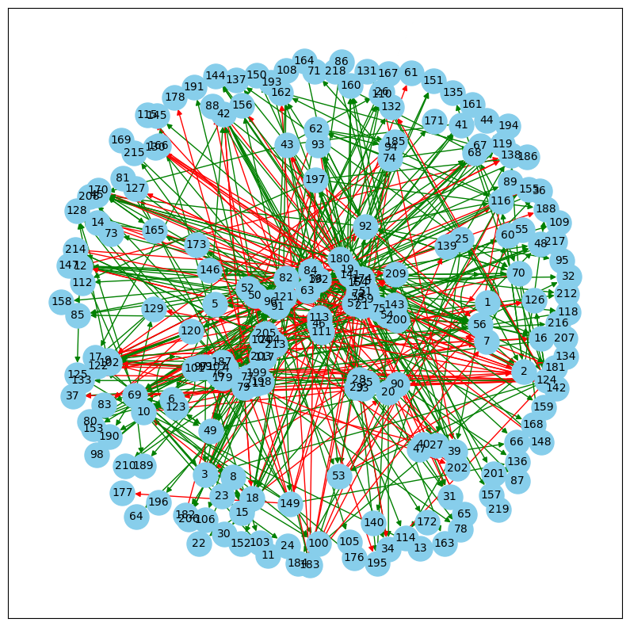

## Výskumná otázka 1: Prevažujú v našej sieti skôr pozitívne alebo negatívne spomenutia. (Prevažovala v tomto roku skôr negatívna kritická nálada s nezhodami alebo viac pozitívna s vyjadrením podpory) / Zoskupujú sa politici na základe spoločnej podpory / opozície?

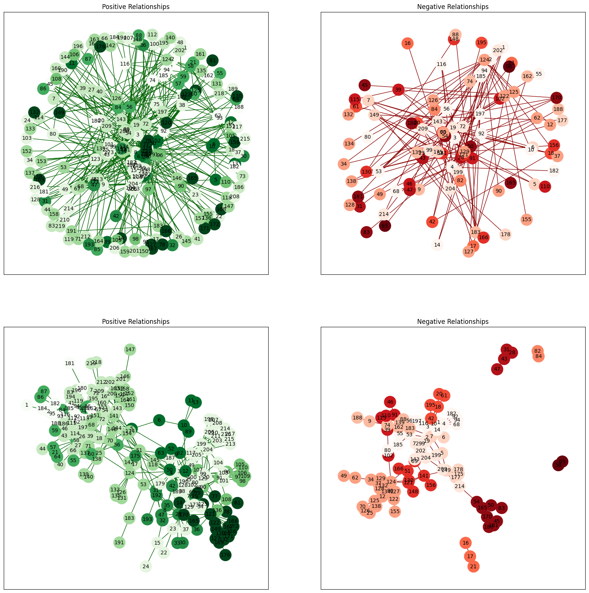

Našu sieť sme si rozdelil na dve podsiete, podľa váh na hranách. Takto sme dostali dve nové siete, ktoré môžeme vidieť nižšie na grafe. Vľavo je sieť zložená z kladných hrán, ktoré reprezentujú pozitívne spomenutia, vpravo zo záporných hrán, ktoré reprezentujú negatívne spomenutia. Zobrazili sme si tieto siete do dvoch riadkov.

V prvom riadku sú obe siete s rovnakým rozložením vrcholov, aby sme vedeli vizuálne porovnať, ktoré vrcholy sa nachádzajú v pozitívnych aj negatívnych sieťach. Z výsledkov sme ale zistili, že pozitívna sieť obsahuje 212 vrchol (takmer všetky) a 472 hrán. Záporná sieť obsahuje menej ako polovicu kongresmanov z celkového počtu (97) a majú 116 hrán, resp. negatívnych zmienok. Môžeme teda z týchto pozorovaní vidieť, že pozitívne zmienky v diskusiách sú častejšie. Môže to naznačovať to, že v tomto roku títo politici mávali skôr zhodné názory a nepreberali až také množstvo kontroverzných tématík.
V druhom riadku sú vrcholy usporiadané tak, aby boli vrcholy v rámci jednej komunity blízko seba. Vrcholy sme do komunít zaradili tak, aby sme maximalizovali modularitu v sieti medzi komunitami. Použili sme python knižnicu community_louvain.

Komunita, v našej sieti predstavuje skupiny kongresmanov, ktorí sa navzájom spomínajú vo svojich prejavoch. V kladnej sieti majú tieto komunity veľký význam - ide o politikov, ktorí sa navzájom podporujú a spolupracujú. V priemere majú takéto komunity 20 členov, najmenšia má 5 členov a najväčšia 45 členov. Z našej siete ale vidno, že aj tieto komunity navzájom sa celkom podporujú. Negatívne komunity predstavujú skupiny politikov, ktorí medzi sebou najviac nesúhlasia alebo si oponujú. Týchto komunít je viac, ale sú menšie, s priemernoým počtom členov 8, minimom 2 a maximom 17. 

Pozitívne vzťahy medzi kongresmanmi vytvárajú prepojenejšie komunity. Toto tvrdenie nám aj podporuje modularita, ktorá nám vyšla vyššia v kladnej sieti. (Vyššia modularita znamená slabšie prepojenie medzi vzniknutými komunitami.) 

Z grafu by sme pre kladnú sieť mohli očakávať vyššiu hustotu, ale v skutočnosti je hustota kladnej siete nižšia ako hustota zápornej siete ( 1.9% < 2.3% ) aj keď nie výrazne. Tento prekvapivý výsledok je spôsobený vysokým počtom vrcholov v kladnej sieti.

V pozitívnej komunite je priemerný stupeň vrcholov 3.9 a stredná hodnota iba 2. Priemer je vychýlený maximálnym stupňom, ktorý je v pozitívnej sieti až 28. V negatívnej sieti sú tieto hodnoty nižšie. Priemerný stupeň je 2.2, stredná hodnota len 1, maximum je 15. Vyplýva z toho, že pozitívne interakcie sú častejšie ako negatívne.

Negatívna sieť má viac komunít (13) ako pozitívna sieť (8), čo naznačuje, že negatívne interakcie sú viac rozdrobené do menších skupín v porovnaní s pozitívnymi interakciami. Zaroveň môžeme z grafu pozorovať, že niektoré z týchto komunít sp od hlavného komponentu odelené. Práve tieto menšie komunity môžu naznačovať rivalských politikov, zaroveň to ale môže predstavovať kongresmanov, ktorí vo všeobecnosti súhlasia s ostatnými až na pár výnimiek.


|                  | Kladná sieť | Záporná sieť |
|------------------|-------------|--------------|
| Modularita       | 0.609       |  0.72        |
| Hustota          | 0.019       |  0.023       |
| Priemerný stupeň | 3.925       |  2.206       |
| Počet komunít    | 8           | 13           |

## Výskumná otázka 2: Nachádzajú sa v našej sieti politici, ktorí majú väčší vplyv ako ostaní alebo odlišujú sa od ostatných?
Pri tejto otázke sme sa museli zamyslieť nad tým, čo pre nás predstavuje vplyvný politik a podľa toho ho skúsiť identifikovať. 

Politik s výsokým počtom zmienok:
Vplyvný politik v našej situácií môže predstavovať osobu, ktorú veľa ľudí spomína, či už kladne alebo záporne, alebo táto osoba vo svojich prejavoch spomína množstvo politikov. Takýto vplyv naznačuje, že títo kongresmani sa aktívne zapájajú do viacerých diskusií alebo tém, čo svedčí o ich aktívnej účasti v sieti. Z politického hľadiska môžu tieto osoby často vyjadrovať názory, navrhovať iniciatívy alebo byť veľmi aktívny v diskusiách, čo z nich robí ústredné postavy. 

Týchto politikov sme identifikovali pomocou centrality stupňa vrcholov, ktorá vyjadruje podiel počtu susedov a počtu všetkých vrcholov. Môže ju pozorovať na ľavom grafe, kde väčšie krúžky znamenajú vyššiu centralitu. Môže vidieť, že je takýchto vrcholov / politikov viacero a prevažne v strede.

Politik spájajúci komunity:
Betweenness centrality, centralita prepojenosti, vyjadruje podiel najkratších prechádzajúcich daným vrcholom a všetkých najkratších ciest. Môžeme si všimnúť, že na obvode stredného grafu sú prevažne vrcholy s centralitou nula. Tieto vrcholy majú len vchádzajúce hrany, a žiadne vychádzajúce. Hoci betweenness centralita nemusí nevyhnutne naznačovať priamy vplyv alebo moc, naznačuje, že uzol (v našom kontexte politik) má potenciál ovplyvňovať nepriamo prostredníctvom kontroly toku informácií alebo komunikačných ciest v sieti. V našom prípade to ale však môže indikovať klúčovú osobu ako prezident senátu, ktorý sa príhovoroch vyjadrujú k rozdielnym skupinám v sieti pozitívne alebo aj negatívne. Vidíme, že takúto osobu representuje vrchol s číslom 124.

Closeness centrality:
Treťou a poslednou centralitou je centralita blízkosti. Tá vyjadruje priemernú vzdialenosť vrcholu od ostatných vrcholov a počíta sa ako podiel jednotky a priemernej vzdialenosti. Hoci nemusí byť vplyv osoby s takouto vysokou centralitou hneď očividný, môže predstavovať následné veci. Kongresmani s vysokou centralitou blízkosti by mohli mať významný vplyv na rozhodovacie procesy v rámci kongresu. Ich schopnosť rýchlo šíriť informácie a komunikovať s ostatnými im môže umožniť formovať diskusie, vytvárať koalície a ovplyvňovať hlasovanie o legislatívnych otázkach. Tuto ale môže vidieť z pravého grafu, že väčšina vrcholov má porovnateľné centrality až na pár výnimiek, ktoré majú nulové centrality. Títo politici môžu representovať práve také osobnosti, ktoré sa menej zapájajú do diskusií a skôr sa orientujú a debatujú s menej vplyvnými kongresmanmi, s menším počtom spomínaní.


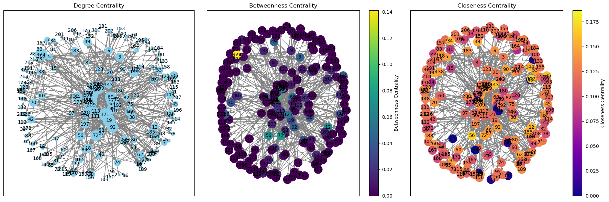

## Výskumná otázka 3: Analýza distribúcie in-degree a out-degree vrcholov a vyplývajúce otázky z analýzi

Na začiatku sme sa pozreli na rozdelenia stupňa vrcholov z pohľadu vchádzajúcich aj vycházdajúcich hrán. Vykreslili sme si histogram oboch typov stupňov, z ktorého sme sa dovtípili, že by mohlo ísť o mocninovú distribúciu. 

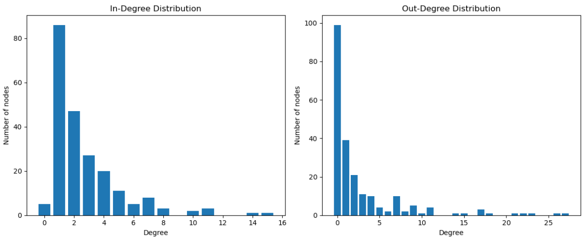
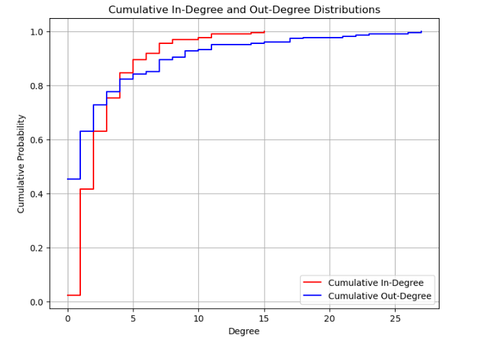

Hypotézu sme overili dvomi metódami. Spravili sme log-log plot. Pre in-degree log-log plot pripomínal priamku, ale pre out-degree to nebolo voľným okom jasné. 
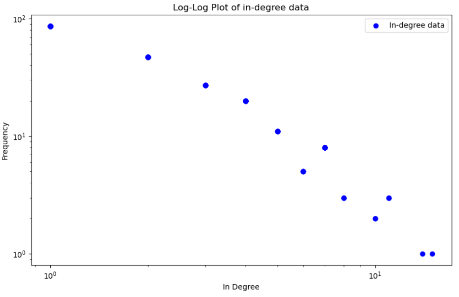
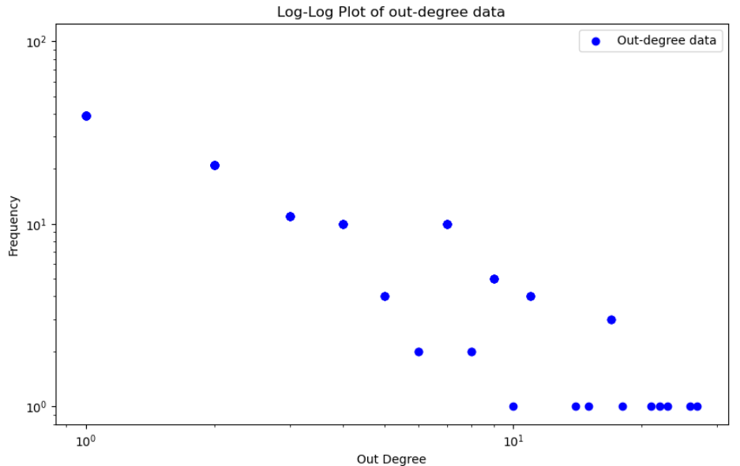

Rozhodli sme sa preto porovnať rozdelenie našich dát s mocninovou distribúciou. K tomu sme vykonali nasledovné kroky:
- Fitovanie na power-law distribúciu: Používame metódu powerlaw.Fit(), ktorá fituje upravené dáta na power-law distribúciu. Táto metóda odhaduje parametre distribúcie, ako napríklad exponent power-law distribúcie.
- Vykreslenie dát a fitu: Po fitovaní dát na power-law distribúciu vytvárame graf, ktorý zobrazuje kumulatívnu distribučnú funkciu (CCDF) dát (modrá krivka) a fitovanú power-law distribúciu (červená křivka). Význam modrej krivky je, že zobrazuje reálne dáta, ktoré sme merali v sieti a červená krivka zobrazuje distribúciu, ktorá je najlepším odhadom distribúcie, ktorú sme dostali pomocou metódy fitovania.

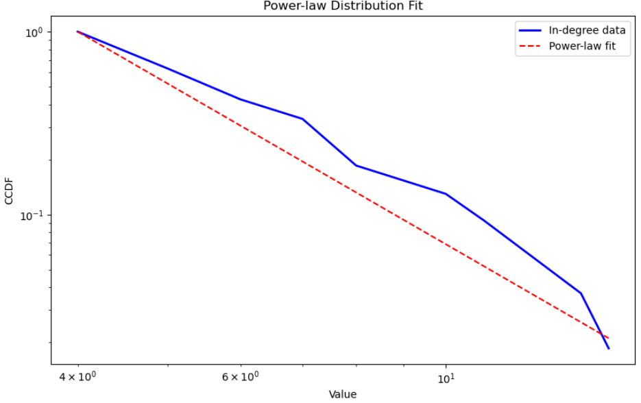
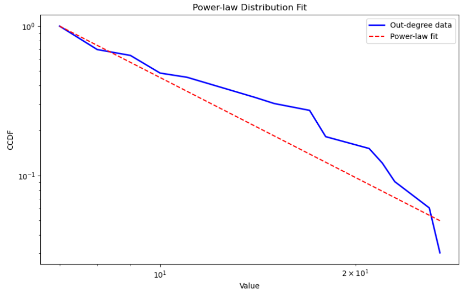

- Hodnotenie zhody s power-law distribúciou: Vypočítavame parametre fitovanej distribúcie, ako je exponent power-law distribúcie. Taktiež sa vypočítava likelihood ratio, čo je pomer vierohodností fitovanej power-law distribúcie a fitovanej exponenciálnej distribúcie. Tieto hodnoty nám poskytujú informácie o tom, ako dobre sa dáta fitujú na power-law distribúciu a aký je odhadnutý exponent tejto distribúcie.

K rozhodnutiu sme použili distribution_compare funkciu z powerlaw knižnice. Táto funkcia vráti 2 hodnoty: pomer vierohodnosti a p-value Likelihood ratio testu kde H0: Exponenciálne rozdelenie popisuje dáta aspoň tak dobre ako mocninové rozdelenie vs. H1: Mocninové rozdelenie popisuje dáta lepšie ako exponenciálne.

Ak je prvá hodnota tuple (pomer vierohodnosti) kladná, znamená to, že mocninové rozdelenie lepšie zodpovedá údajom v porovnaní s exponenciálnym rozdelením. To naznačuje, že údaje vykazujú charakteristiky, ktoré lepšie vystihuje mocninové rozdelenie ako exponenciálne rozdelenie.

Ak je však druhá hodnota (p-value) väčšia ako 0.05, znamená to, že rozdiel v zhode medzi týmito dvoma rozdeleniami nie je štatisticky významný na hladine významnosti 0.05. Inými slovami, hoci rozdelenie podľa mocninového zákona môže poskytovať lepšiu zhodu s údajmi z hľadiska vierohodnosti, toto zlepšenie nemusí byť dostatočne signifikantné na to, aby sa s istotou zamietla nulová hypotéza, že exponenciálne rozdelenie zodpovedá údajom rovnako dobre ako mocninové rozdelenie.

Kedže hodnoty vyšli (1.5908491600959662, 0.4287718670094911), respektíve (3.472833620708208, 0.12953250162386012) tak na základe prvej hodnoty môžme povedať, že mocninové rozdelenie popisuje rozdelenie in-degree aj out-degree lepšie, ale p-value > 0.05 hovorí o tom, že rozdiel nie je signifikantný a teda nemôžme zamietnuť nulovú hypotézu.

Po tejto analýze sme chceli analyzovať tendencie politikov a zodpovedať otázku či sa v našej sieti nachádzajú politici, ktorí spomínajú iných, ale ich nikto nespomína a naopak. K tomu sme politikov rozdelili do štyroch množín in-degree > 0, out-degree > 0, in-degree = 0 a out-degree = 0. Spravili sme 2 prieniky množín. Prvý prienik množín in-degree > 0 a out-degree = 0 sme nazvali Recipients - reprezentuje politikov, ktorí nemajú tendenciu spomínať ostatných, ale boli aspoň raz spomenutí. Druhý prienik množín out-degree > 0 a in-degree = 0 sme nazvali Broadcasters - reprezentuje politikov, ktorí majú tendenciu spomínať ostatných, ale nikdy neboli spomenutí. Na vennovom diagrame môžme vidieť, že v sieti sa nachádza 99 Recipients a 5 Broadcasters. 

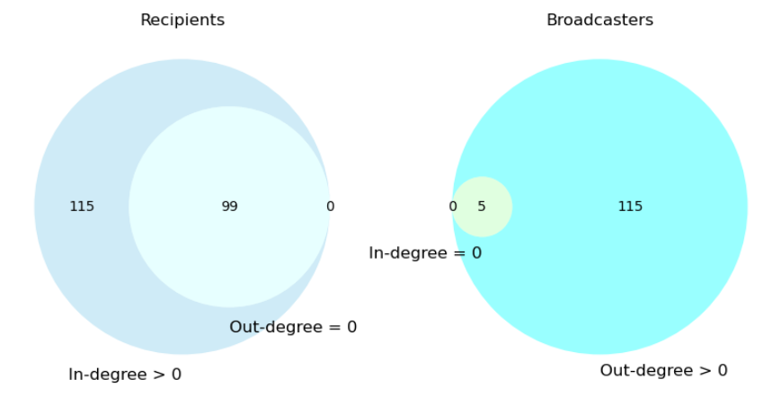

Ďalej z histogramu uvedenom v úvode tejto časti vidíme, že je veľké množstvo politikov, ktorí nikoho nespomínajú, ale zato takmer všetci sú v debatách spomenutí. Pri pohľade na out-degree distribúciu histogramu vieme pozorovať určitý fenomén ktorý sa vyskytuje pri powe-law distribúcií. Ktorý vyzerá že je prítomný v odľahlých hodnotách na konci pravého chvosta distribúcie so senátormi s vysokými spomínaním ostatných senátorov. Títo senátori významne ovplyvňujú distribúciu pre in-degree, v zmysle toho že skoro každý senátor bol spomenutý aj keď sa v out-degree nachádza veľmi veľký počet takých ktorý nikoho nespomenuli  čo zodpovedá aj vysokému počtu recipientov.  A tým pádom môže ovplyvňovať distribúciu pre in-degree rozdelenie.


## Výskumná otázka 4: Existujú v sieti silno súvislé komponenty ?

SSK identifikujú skupiny politikov, ktorí sú úzko prepojení prostredníctvom vzájomných zmienok, či už pozitívnych alebo negatívnych. Tieto komponenty odzrkadľujú skupiny s vysokým stupňom interných interakcií. Pokúsili sme sa identifikovať SSK na pozitívnej a negatívnej podsieti. K hľadaniu SSK sme použili funkciu strongly_connected_components z knižnice networkx.

SSK v pozitívnej sieti by predstavovali skupiny politikov, ktorí sa často a vzájomne podporujú. Mohlo by ísť o frakcie alebo koalície s podobnými politickými záujmami alebo cieľmi. Zistili sme, že v pozitívnej sieti sa nachádza 126 SSK, z toho 4 obsahujú aspoň dva vrcholy. Najvačší SSK obsahuje 84 vrcholov a zvyšné tri obsahujú 2 vrcholy. Jednotlivé SSK sú v grafe odlíšené farbou. Sivou farbou sú vyznačené SSK veľkosti 1.

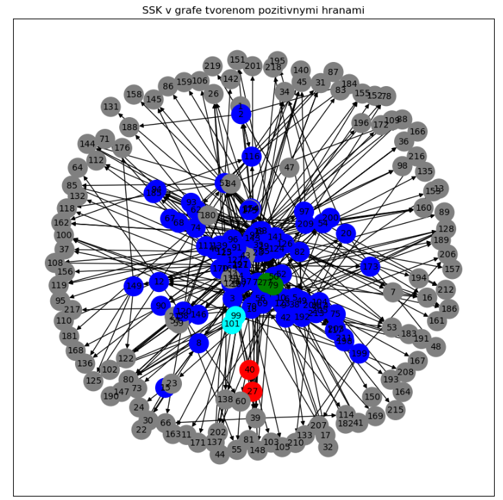

V negatívnej sieti by SSK ukazovali skupiny politikov, ktorí sú často spomenutí v kontexte konfliktov alebo opozície. Môže ísť o skupiny, ktoré sa navzájom kritizujú alebo sú v konflikte. Zistili sme, že v negatívnej sieti sa nachádza 88 SSK, z toho 7 obsahujú aspoň dva vrcholy. SSK v negatívnej sieti sú malé, kde 5 SSK obsahuje 2 vrcholy a 2 SKK obsahujú 3 vrcholy. Jednotlivé SSK sú v grafe odlíšené farbou. Sivou farbou sú vyznačené SSK veľkosti 1.

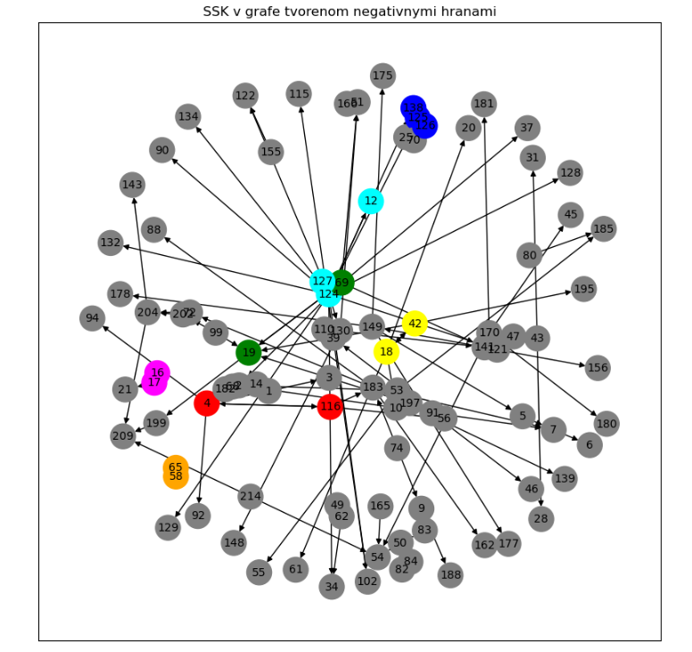

Vhodné vylepšenie by bolo prevedenie kondenzácie oboch grafov a nastavenie veľkosti vrcholu podľa počtu obsahujúcich vrcholov.

## Výskumná otázka 5: Ako ovplyvňuje spomínanie samého seba celú sieť ?

Chceli sme odsledovať či majú politici tendenciu rozprávať o sebe a ak áno tak v akom svetle.
Zistili sme, že v sieti sa nachádzajú iba 2 slučky a v oboch prípadoch išlo o unikátneho politika, ktorý o sebe rozprával v pozitívnom zmysle.

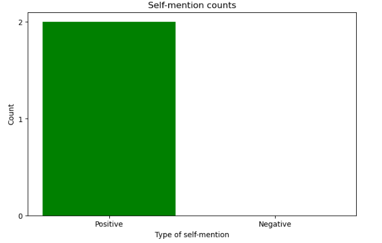

Ďalej sme chceli zistiť aký majú slučky vplyv na sieť zistením korelácie medzi počtom slučiek jednotlivých vrcholov a ich centrality.
Avšak kvôli nízkemu počtu slučiek sme vyvodili záver, že v ich analýze nebudeme pokračovať, lebo by nepriniesla žiadne užitočné informácie.

## Záver

## Zdroje/citácie
```
@MISC{konect:2018:convote,
    title = {Congress votes network dataset -- {KONECT}},
    month = jan,
    year = {2018},
    url = {http://konect.cc/networks/convote}
}

@inproceedings{konect:convote,
	author = {Matt Thomas and Bo Pang and Lillian Lee},
	title = {Get the Out Vote: Determining Support or Opposition from
                  Congressional Floor-Debate Transcripts},  
	booktitle = {Proc. Conf. on Empir. Methods in Nat. Lang. Process.},
	pages = {327--335},
	year = {2006},
}

@inproceedings{konect:convote,
	author = {Matt Thomas and Bo Pang and Lillian Lee},
	title = {Get the Out Vote: Determining Support or Opposition from
                  Congressional Floor-Debate Transcripts},  
	booktitle = {Proc. Conf. on Empir. Methods in Nat. Lang. Process.},
	pages = {327--335},
	year = {2006},
}


@inproceedings{konect,
	title = {{KONECT} -- {The} {Koblenz} {Network} {Collection}},
	author = {Jérôme Kunegis},
	year = {2013},
	booktitle = {Proc. Int. Conf. on World Wide Web Companion},
	pages = {1343--1350},
	url = {http://dl.acm.org/citation.cfm?id=2488173},
	url_presentation = {https://www.slideshare.net/kunegis/presentationwow},
	url_web = {http://konect.cc/},
	url_citations = {https://scholar.google.com/scholar?cites=7174338004474749050},
}

@inproceedings{konect,
	title = {{KONECT} -- {The} {Koblenz} {Network} {Collection}},
	author = {Jérôme Kunegis},
	year = {2013},
	booktitle = {Proc. Int. Conf. on World Wide Web Companion},
	pages = {1343--1350},
	url = {http://dl.acm.org/citation.cfm?id=2488173},
	url_presentation = {https://www.slideshare.net/kunegis/presentationwow},
	url_web = {http://konect.cc/},
	url_citations = {https://scholar.google.com/scholar?cites=7174338004474749050},
}
```
