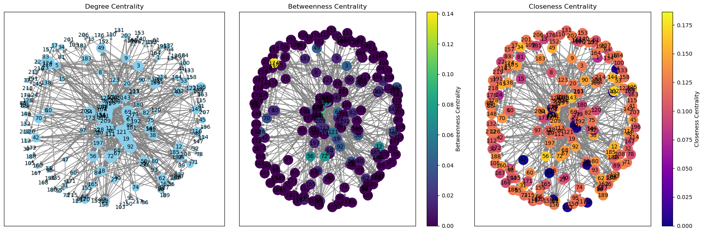
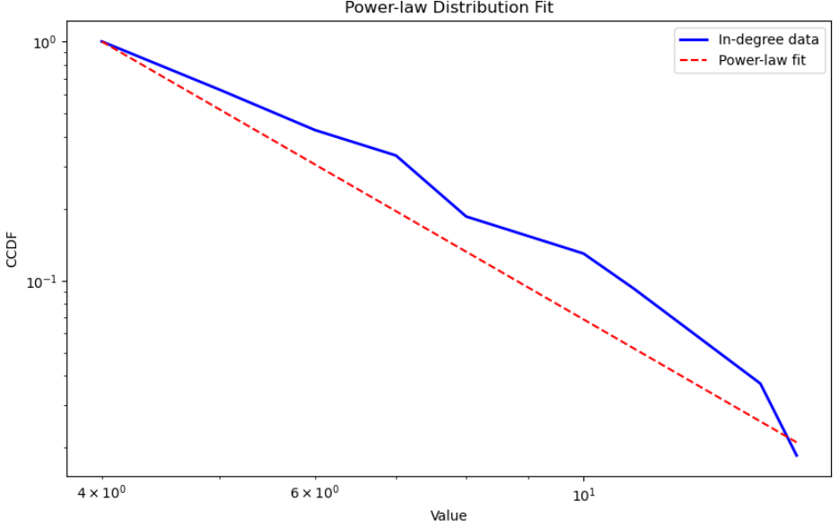
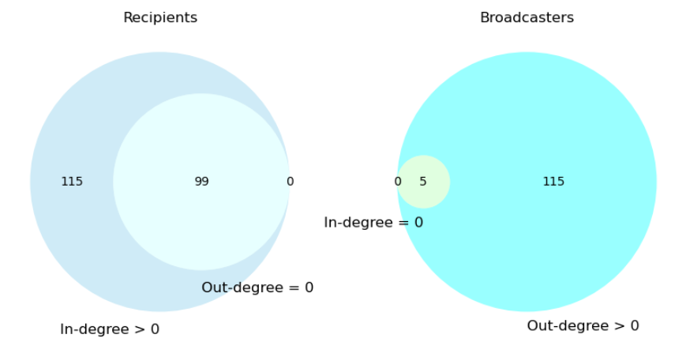

# Analýza ... medzi členmi kongresu Spojených štátov Amerických
```
Veda o sieťach, 2024
Roderik Antol, Tomáš Belák, Adam Lopaška, František Václav Man
```

## Popis siete
Naša sieť popisuje rečnícke prejavy politikov Kongresu Spojených štátov. V sieti máme 219 kongresmanov (vrcholov) a 764 hrán - spomenutí kongresmana vo svojom prejave. Hrany sú orientované, váhované a graf obsahuje násobné hrany a slučky. Váha hrany závisí od charakteru spomenutia - kladné spomenutie/súhlas má váhu `1` a negatívne spomenutie/nesúhlas má váhu `-1`. 

<!Naša sieť obsahuje 219 vrcholov - členov kongresu. Hrany reprezentujú, či a ako sa spomínajú vo svojich rečiach. Hrany sú orientované a ováhované. Orientácia je samozrejmá, kongresman A spomína kongresmana B. Váha hrany môže byť kladná - vo svojej reči podporuje kongresmana B alebo záporná - oponuje mu/nesúhlasí s ním. Sieť môže obsahovať násobné hrany - niekoho môžem spomenúť viackrát, a slučky - spomínam sám seba. Všetkých hrán je 764.>


## Výskumná otázka 1: štruktúra siete a detekcia komunít
Priemerný stupeň vrcholov siete je `6.98`. Teda za sledované obdobie bol priemerný kongresman spomenutý v niekoho reči (aj svojej), alebo spomínal niekoho vo svojej skoro 7-krát.

Našu sieť sme si rozdelil na dve podsiete, podľa váh na hranách. Takto sme dostali dve nové siete, ktoré môžeme vidieť nižšie na grafe. Vľavo je sieť zložená z kladných hrán (pozitívne spomenutie), vpravo zo záporných hrán (negatívne spomenutie). V prvom riadku sú obe siete s rovnakým rozložením vrcholov, a v druhom riadku sú vrcholy usporiadané tak, aby boli vrcholy v rámci jednej komunity blízko seba. Vrcholy sme do komunít zaradili tak, aby sme maximalizovali modularitu v sieti medzi komunitami. Použili sme python knižnicu community_louvain.


### Vlastnosti sietí a komunít

Komunita, v našej sieti, predstavuje skupiny kongresmanov, ktorí sa navzájom spomínajú vo svojich prejavoch. V kladnej sieti majú tieto komunity veľký význam - ide o politikov, ktorí sa navzájom podporujú a spolupracujú. V priemere majú takéto komunity 20 členov, najmenšia má 5 členov a najväčšia 45 členov. Z našej siete ale vidno, že aj tieto komunity navzájom sa celkom podporujú. Negatívne komunity predstavujú skupiny politikov, ktorí medzi sebou najviac nesúhlasia alebo si oponujú. Týchto komunít je viac, ale sú menšie, s priemernoým počtom členov 8, minimom 2 a maximom 17. Pozitívne vzťahy medzi kongresmanmi vytvárajú prepojenejšie komunity.

Za zmienku ale stojí, že pozitívna sieť má 212 vrcholov a 472 hrán, zatiaľ čo negatívna sieť má 97 vrcholov a 116 hrán. V pozitívnej komunite je priemerný stupeň vrcholov 3.9 a stredná hodnota iba 2. Priemer je vychýlený maximálnym stupňom, ktorý je v pozitívnej sieti až 28. V negatívnej sieti sú tieto hodnoty nižšie. Priemerný stupeň je 2.2, stredná hodnota len 1, maximum je 15. Vyplýva z toho, že pozitívne interakcie sú častejšie ako negatívne.

Modularita zápornej siete je vyššia ako modularita kladnej siete. Vyššia modularita znamená slabšie prepojenie medzi vzniknutými komunitami. Vyplýva z toho, že kladná sieť je lepšie prepojená a pri prípadnej simulácii šírenia informácie by sa informácia lepšie šírila práve v kladnej sieti.

Z grafu by sme pre kladnú sieť mohli očakávať vyššiu hustotu, ale v skutočnosti je hustota kladnej siete nižšia ako hustota zápornej siete ( 1.9% < 2.3% ). Tento prekvapivý výsledok je spôsobený vysokým počtom vrcholov v kladnej sieti.

Negatívna sieť má viac komunít (13) ako pozitívna sieť (8), čo naznačuje, že negatívne interakcie sú viac rozdrobené do menších skupín v porovnaní s pozitívnymi interakciami.

|                  | Kladná sieť | Záporná sieť |
|------------------|-------------|--------------|
| Modularita       | 0.609       |  0.72        |
| Hustota          | 0.019       |  0.023       |
| Priemerný stupeň | 3.925       |  2.206       |
| Počet komunít    | 8           | 13           |

### Nesúvislosť negatívnej siete
V negatívnej sieti je jeden hlavný komponent a 4 menšie komponenty. Menšie komponenty môžu predstavovať kongresmanov, ktorí všeobecne súhlasia s ostatnými, ale v niektorích špecifických situáciách/témach sa nezhodnú.

## Výskumná otázka 2: analýza centralít
V tejto časti sa pokúsime nájsť kongresmanov s najväčším vplyvom pomocou centralít. Prvou je centralita stupňa vrchola. Na ľavom grafe väčší krúžok znamená vyššiu centralitu. Môžeme si všimnúť, že čím je vrchol bližšie stredu, tým je jeho centralita vyššia. Centralita stupňa vrchola vyjadruje podiel počtu susedov a počtu všetkých vrcholov.
**vysvetliť, aký má význam/interpretovať centralitu**

Betweenness centrality, centralita prepojenosti, vyjadruje podiel najkratších prechádzajúcich daným vrcholom a všetkých najkratších ciest. Môžeme si všimnúť, že na obvode grafu sú prevažne vrcholy s centralitou nula. Tieto vrcholy majú len vchádzajúce hrany, a žiadne vychádzajúce. Kongresmani s vysokou centralitou prepojenosti môžu predstavovať kľúčových politikov, ktorí sa príhovoroch vyjadrujú k rozdielnym skupinám v sieti pozitívne alebo aj negatívne. **Popisat body s vysokou centralitou**

Treťou centralitou je centralita blízkosti. Tá vyjadruje priemernú vzdialenosť vrcholu od ostatných vrcholov a počíta sa ako podiel jednotky a priemernej vzdialenosti. 



## Výskumná otázka 3: Broadcasters&Recipients

Na začiatku sme sa pozreli na rozdelenia stupňa vrcholov z pohľadu vchádzajúcich aj vycházdajúcich hrán. Vykreslili sme si histogram oboch typov stupňov, z ktorého sme sa dovtípili, že by mohlo ísť o mocninovú distribúciu. 


Hypotézu sme overili dvomi metódami. Spravili sme log-log plot. Pre in-degree log-log plot pripomínal priamku, ale pre out-degree to nebolo voľným okom jasné. 


Rozhodli sme sa preto porovnať rozdelenie našich dát s mocninovou distribúciou. K tomu sme vykonali nasledovné kroky:
- Fitovanie na power-law distribúciu: Používame metódu powerlaw.Fit(), ktorá fituje upravené dáta na power-law distribúciu. Táto metóda odhaduje parametre distribúcie, ako napríklad exponent power-law distribúcie.
- Vykreslenie dát a fitu: Po fitovaní dát na power-law distribúciu vytvárame graf, ktorý zobrazuje kumulatívnu distribučnú funkciu (CCDF) dát (modrá krivka) a fitovanú power-law distribúciu (červená křivka). Význam modrej krivky je, že zobrazuje reálne dáta, ktoré sme merali v sieti a červená krivka zobrazuje distribúciu, ktorá je najlepším odhadom distribúcie, ktorú sme dostali pomocou metódy fitovania.




- Hodnotenie zhody s power-law distribúciou: Vypočítavame parametre fitovanej distribúcie, ako je exponent power-law distribúcie. Taktiež sa vypočítava likelihood ratio, čo je pomer vierohodností fitovanej power-law distribúcie a fitovanej exponenciálnej distribúcie. Tieto hodnoty nám poskytujú informácie o tom, ako dobre sa dáta fitujú na power-law distribúciu a aký je odhadnutý exponent tejto distribúcie.

K rozhodnutiu sme použili distribution_compare funkciu z powerlaw knižnice. Táto funkcia vráti 2 hodnoty: pomer vierohodnosti a p-value Likelihood ratio testu kde H0: Exponenciálne rozdelenie popisuje dáta aspoň tak dobre ako mocninové rozdelenie vs. H1: Mocninové rozdelenie popisuje dáta lepšie ako exponenciálne.

Ak je prvá hodnota tuple (pomer vierohodnosti) kladná, znamená to, že mocninové rozdelenie lepšie zodpovedá údajom v porovnaní s exponenciálnym rozdelením. To naznačuje, že údaje vykazujú charakteristiky, ktoré lepšie vystihuje mocninové rozdelenie ako exponenciálne rozdelenie.

Ak je však druhá hodnota (p-value) väčšia ako 0.05, znamená to, že rozdiel v zhode medzi týmito dvoma rozdeleniami nie je štatisticky významný na hladine významnosti 0.05. Inými slovami, hoci rozdelenie podľa mocninového zákona môže poskytovať lepšiu zhodu s údajmi z hľadiska vierohodnosti, toto zlepšenie nemusí byť dostatočne signifikantné na to, aby sa s istotou zamietla nulová hypotéza, že exponenciálne rozdelenie zodpovedá údajom rovnako dobre ako mocninové rozdelenie.

Kedže hodnoty vyšli (1.5908491600959662, 0.4287718670094911), respektíve (3.472833620708208, 0.12953250162386012) tak na základe prvej hodnoty môžme povedať, že mocninové rozdelenie popisuje rozdelenie in-degree aj out-degree lepšie, ale p-value > 0.05 hovorí o tom, že rozdiel nie je signifikantný a teda nemôžme zamietnuť nulovú hypotézu.

Po tejto analýze sme chceli analyzovať tendencie politikov a zodpovedať otázku či sa v našej sieti nachádzajú politici, ktorí spomínajú iných, ale ich nikto nespomína a naopak. K tomu sme politikov rozdelili do štyroch množín in-degree > 0, out-degree > 0, in-degree = 0 a out-degree = 0. Spravili sme 2 prieniky množín. Prvý prienik množín in-degree > 0 a out-degree = 0 sme nazvali Recipients - reprezentuje politikov, ktorí nemajú tendenciu spomínať ostatných, ale boli aspoň raz spomenutí. Druhý prienik množín out-degree > 0 a in-degree = 0 sme nazvali Broadcasters - reprezentuje politikov, ktorí majú tendenciu spomínať ostatných, ale nikdy neboli spomenutí. Na vennovom diagrame môžme vidieť, že v sieti sa nachádza 99 Recipients a 5 Broadcasters. 



Ďalej z histogramu uvedenom v úvode tejto časti vidíme, že je veľké množstvo politikov, ktorí nikoho nespomínajú, ale zato takmer všetci sú v debatách spomenutí. *TODO ADAM DOPISAT*


## Výskumná otázka 4: Silno súvislé komponenty

## Výskumná otázka 5: Analýza self-mentions

## Záver

## Zdroje/citácie
```
@MISC{konect:2018:convote,
    title = {Congress votes network dataset -- {KONECT}},
    month = jan,
    year = {2018},
    url = {http://konect.cc/networks/convote}
}

@inproceedings{konect:convote,
	author = {Matt Thomas and Bo Pang and Lillian Lee},
	title = {Get the Out Vote: Determining Support or Opposition from
                  Congressional Floor-Debate Transcripts},  
	booktitle = {Proc. Conf. on Empir. Methods in Nat. Lang. Process.},
	pages = {327--335},
	year = {2006},
}

@inproceedings{konect:convote,
	author = {Matt Thomas and Bo Pang and Lillian Lee},
	title = {Get the Out Vote: Determining Support or Opposition from
                  Congressional Floor-Debate Transcripts},  
	booktitle = {Proc. Conf. on Empir. Methods in Nat. Lang. Process.},
	pages = {327--335},
	year = {2006},
}


@inproceedings{konect,
	title = {{KONECT} -- {The} {Koblenz} {Network} {Collection}},
	author = {Jérôme Kunegis},
	year = {2013},
	booktitle = {Proc. Int. Conf. on World Wide Web Companion},
	pages = {1343--1350},
	url = {http://dl.acm.org/citation.cfm?id=2488173},
	url_presentation = {https://www.slideshare.net/kunegis/presentationwow},
	url_web = {http://konect.cc/},
	url_citations = {https://scholar.google.com/scholar?cites=7174338004474749050},
}

@inproceedings{konect,
	title = {{KONECT} -- {The} {Koblenz} {Network} {Collection}},
	author = {Jérôme Kunegis},
	year = {2013},
	booktitle = {Proc. Int. Conf. on World Wide Web Companion},
	pages = {1343--1350},
	url = {http://dl.acm.org/citation.cfm?id=2488173},
	url_presentation = {https://www.slideshare.net/kunegis/presentationwow},
	url_web = {http://konect.cc/},
	url_citations = {https://scholar.google.com/scholar?cites=7174338004474749050},
}
```
